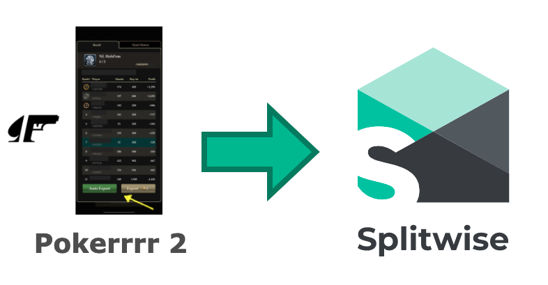
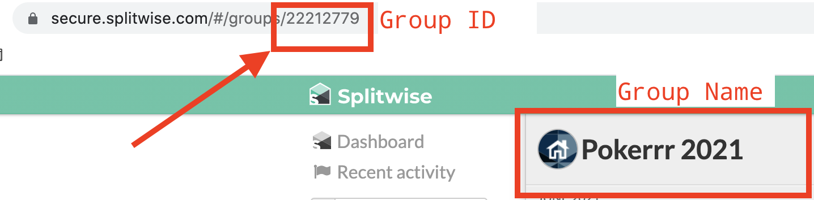

# Welcome to Pokerrrr2-to-Splitwise &#9824;&#9830;&#9827;&#9829;

A simple utility to automatically generate Splitwise expenses based on Pokerrrr2 exported CSV results.




## Features

* **Expenses** : Generate splitwise expense entries from exported Pokerrrr2 `.csv` files

* **Reports** : Generate summary reports from list of pokerrr2 reports. Useful for generating weekly / monthly reports

## Quick Start

1. Clone the repository

```
git clone https://github.com/callmepjs/pokerrrr2-to-splitwise.git
```

2. Install dependencies and build the app

```
cd pokerrrr2-to-splitwise
npm install
npm run build
```

3. Run the application

```
node build/index.js
```

## Options

Run the app and provide the following options when prompted:

* `[expense | report]` : Choose whether you want to generate an expense or a report
* `[file | folder]` : Enter filename for expenses, folder for reports
* `[hosting fees ($)]` : Hosting fees, if someone is covering hosting fees
* `[host]` : Splitwise username of the person hosting
* `[create splitwise ?]` : `0` for dryrun, `1` to create report

## Configuration

### Pokerrr

Adjust pokerrrr chip to dollar ratio in `config.pokerrrr.chip_to_dollar_ratio`.
Default: `1 chip` = `$ 1`

### Splitwise

If you plan to interact with Splitwise, you'll need the following information from Splitwise

  1. [Register your application and generate keys for your application](https://secure.splitwise.com/apps/new)

  2. Retrieve the `ID` of the Splitwise group you want to expense to.
    You can find this information by logging into Splitwise and selecting the group as shown below:
    
  
Enter this information in `src/config.ts`

```
export  const config = {
    splitwise : {
        key      : '<splitwise_consumer_key>',
        secret   : '<splitwise_consumer_secret>',
        group_id : '<splitwise_expense_group_id>',
    },
```

 In cases where the Pokerrr2 player names are different than Splitwise group member names, you can add an explicit mapping for associating users between Pokerrrr2 and Splitwise. This is configured in `src/config.ts` as shown below:

```
  pkr2SwMapping : {
    "#Pokerrrr2_ID" : "SPLITWISE_FIRST_NAME"
    "#D6LSA" : "BUDDY1",
    "#79QS8" : "BUDDY2",
    "#SUPY9" : "BUDDY2", // map multiple poker users to same SW user
    ...
  }
```  

## Examples

### Generating Expenses

#### Sample Input
`node build/index.js --action=expense  --file=samples/Pokerrrr_sample_export.csv  --hostingFees=0 --host=PJS --createSplitwise=0`
OR
```
> node build/index js
prompt: [expense | report]:  expense
prompt: [Filename or game ID]:  samples/Pokerrrr_sample_export.csv
prompt: hosting fees ($):  0
prompt: hosted by:  
prompt: enter 1 to create splitwise expense:  0
```

#### Sample Output

```
-----------------------------------------------
 Report for Game ID 21572952
-----------------------------------------------
[✔] PLAYER1     gets  $ 218.25  (148  hands)
[✔] PLAYER2     gets  $ 83.5    (155  hands)
[✔] PLAYER3     gets  $ 27.25   (150  hands)
[✔] PLAYER4     owes  $ 3       (52   hands)
[✔] PLAYER5     owes  $ 41.5    (67   hands)
[✔] PLAYER6     owes  $ 41.75   (154  hands)
[✔] PLAYER7     owes  $ 242.75  (148  hands)
No gold expenses indicated. Skipping.
================================================
 Duration: 3.78 hrs   Players : 7/0
 Cost    : $329       Gold    : $0
================================================
NOTE : This was a dry run. Set createSplitwise to 1 to create expense
```

#### Generating Reports

Run the app and provide the following options when prompted:

* [expense | report] : `report`
* [Filename or game ID] : `directory with .csv files`
* gold cost in $ : `0`
* create splitwise expense : `0`

#### Sample Input

`node build/index.js --action=report  --file=samples/  --hostingFees=0 --host=PJS --createSplitwise=0`

OR
```
> node build/index js
prompt: [expense | report]:  report
prompt: [Filename or game ID]:  samples
prompt: hosting fees ($):  0
prompt: hosted by:  
prompt: enter 1 to create splitwise expense:  0
```

#### Sample Output

```
-----------------------------------------------
 Report for Game ID samples/
-----------------------------------------------
Processing file : Pokerrrr_sample_export.csv
    [ ADD #B20XY ] Player: #B20XY, Profit: 873, Hands: 148
    [ ADD #DV9J9 ] Player: #DV9J9, Profit: 334, Hands: 155
    [ ADD #B7TGK ] Player: #B7TGK, Profit: 109, Hands: 150
    [ ADD #CERYC ] Player: #CERYC, Profit: -12, Hands: 52
    [ ADD #A0BBN ] Player: #A0BBN, Profit: -166, Hands: 67
    [ ADD #GETSW ] Player: #GETSW, Profit: -167, Hands: 154
    [ ADD #79QS8 ] Player: #79QS8, Profit: -971, Hands: 148
================================================
Files procesed      => 1
Report published to => samples/summary-report.csv
================================================
```

## Donation

If you find this project useful, you can buy us a cup of coffee

<a href="https://www.paypal.me/callmepjs" target="blank">
    
</a><br>
